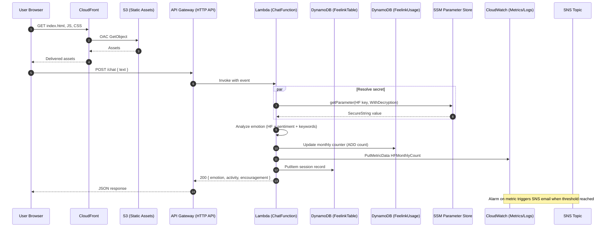

## Feelink Architecture

This document outlines the architecture for the Feelink project: frontend delivery, backend services, data, observability, and deployment.

### High-Level Overview

- **Frontend (Next.js 14 + Tailwind)**: Built from `feelink/frontend`. Static assets are hosted in an S3 bucket and served via CloudFront with Origin Access Control (OAC).
- **Backend (AWS SAM / Lambda + HTTP API)**: One Lambda function (`ChatFunction`) behind an API Gateway HTTP API provides `POST /chat` for emotion analysis and activity suggestions.
- **Data (DynamoDB)**: Stores chat sessions (`FeelinkTable`) and monthly usage counters (`FeelinkUsage`). Optionally reads activities from `ActivitiesEncourageFeelink`.
- **Secrets (SSM Parameter Store + KMS)**: Hugging Face API key stored as SecureString; Lambda reads via `ssm.getParameter` with decryption.
- **Observability (CloudWatch)**: Custom metric `Feelink/HF.HFMonthlyCount` with an alarm and SNS email; Lambda logs.
- **Deployment (SAM/CloudFormation)**: Infrastructure defined in `backend/template.yaml`, deployed as stack `feelink-stack`. Frontend deployed to S3; CloudFront invalidations on updates.

### Component Diagram

```mermaid
flowchart TB
  subgraph Client
    B[Browser]
  end

  subgraph CDN[CloudFront Distribution]
    CF[CloudFront]
  end

  subgraph S3Bucket[S3 Static Site]
    S3[(S3: feelinkfrontendbucketbyw)]
  end

  B <-- static assets --> CF
  CF -- OAC read --> S3

  B -- POST /chat --> APIGW[API Gateway (HTTP API)]
  APIGW --> LAMBDA[Lambda: ChatFunction]

  subgraph Data[DynamoDB]
    D1[(FeelinkTable: Sessions)]
    D2[(FeelinkUsage: Monthly Counters)]
    D3[(ActivitiesEncourageFeelink)]
  end

  LAMBDA --> D1
  LAMBDA --> D2
  LAMBDA -. optional read .-> D3

  subgraph Secrets[SSM Parameter Store + KMS]
    SSM[(HF API Key SecureString)]
  end

  LAMBDA -- getParameter(Decrypt) --> SSM

  subgraph Observability[CloudWatch]
    CWLogs[(Logs)]
    CWMetrics[(Metric: Feelink/HF.HFMonthlyCount)]
    CWAlarm[Alarm: HFMonthlyCountAlarm]
  end

  LAMBDA --> CWMetrics
  LAMBDA --> CWLogs

  subgraph Alerts[SNS]
    SNSTopic[(HFAlertTopic)]
    Email[(Email Subscription)]
  end

  CWAlarm --> SNSTopic --> Email
```

### Request Flow (Sequence)



### AWS Services Used

- API Gateway (HTTP API)
- AWS Lambda
- Amazon DynamoDB
- AWS Systems Manager Parameter Store (+ KMS decrypt)
- Amazon CloudWatch (Logs, Metrics, Alarms)
- Amazon Simple Notification Service (SNS)
- Amazon S3 (static hosting + SAM packaging)
- Amazon CloudFront (with OAC)
- AWS CloudFormation (via AWS SAM)
- AWS IAM

