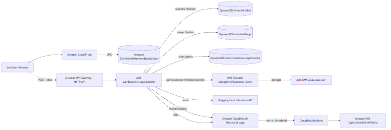
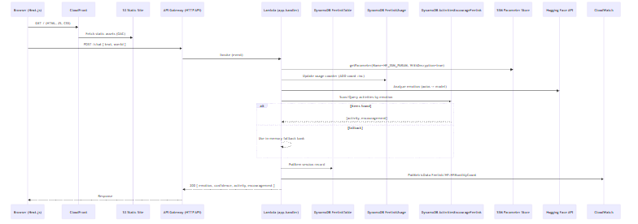
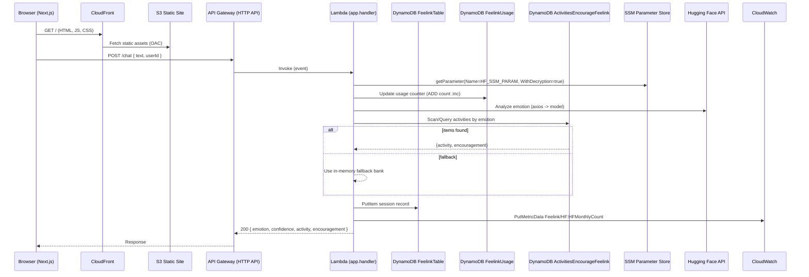

## Feelink Architecture

This document describes the end-to-end architecture of the Feelink project, covering frontend, backend, data flow, AWS services, deployment, security, and operations.

> Diagram sources live in `feelink/docs/`. Generate PNGs with Mermaid CLI and view them locally.

### High-Level Overview

- Frontend: Next.js single-page app hosted on Amazon S3 and served via Amazon CloudFront with Origin Access Control (OAC).
- Backend: AWS SAM stack providing an Amazon API Gateway HTTP API backed by an AWS Lambda function (Node.js 20) that analyzes text emotions using Hugging Face Inference API, stores sessions in Amazon DynamoDB, and tracks monthly usage metrics in CloudWatch with an SNS alert.
- Configuration/Secrets: AWS Systems Manager Parameter Store (SecureString) for the Hugging Face API key, decrypted via AWS KMS managed key for SSM.

### Component Diagram

- Mermaid source: `feelink/docs/component.mmd`
- Generated image: `feelink/docs/component.png`



```mermaid
flowchart LR
  U[End User Browser]
  CF[Amazon CloudFront]
  S3[(Amazon S3\nfeelinkfrontendbucketbyw)]
  APIGW[Amazon API Gateway (HTTP API)]
  L[AWS Lambda\nsrc/app.handler]
  DDB1[(DynamoDB\nFeelinkTable)]
  DDB2[(DynamoDB\nFeelinkUsage)]
  DDB3[(DynamoDB\nActivitiesEncourageFeelink)]
  SSM[AWS Systems Manager\nParameter Store]
  KMS[AWS KMS alias/aws/ssm]
  HF[Hugging Face Inference API]
  CW[Amazon CloudWatch Metrics & Logs]
  ALARM[CloudWatch Alarm]
  SNS[Amazon SNS Topic\nFeelink-HFAlerts]

  U --> CF
  CF -- OAC --> S3
  U -. POST /chat .-> APIGW
  APIGW --> L
  L -- sessions PutItem --> DDB1
  L -- usage Update --> DDB2
  L -- scan/query --> DDB3
  L -- getParameter(WithDecryption) --> SSM
  SSM -- decrypt --> KMS
  L -- axios --> HF
  L -- PutMetricData --> CW
  L -- logs --> CW
  CW -- metric threshold --> ALARM
  ALARM --> SNS
```

### Request Sequence

- Mermaid source: `feelink/docs/sequence.mmd`
- Generated image: `feelink/docs/sequence.png`





### Generate PNG Diagrams

- Using npx (no global install):
  - `npx @mermaid-js/mermaid-cli -i feelink/docs/component.mmd -o feelink/docs/component.png`
  - `npx @mermaid-js/mermaid-cli -i feelink/docs/sequence.mmd -o feelink/docs/sequence.png`

### Data Model

- DynamoDB `FeelinkTable`
  - Partition key: `sessionId` (S)
  - Attributes: `userHash`, `timestamp`, `text`, `emotion`, `confidence`, `method`, `lang`, `details`

- DynamoDB `FeelinkUsage`
  - Partition key: `pk` (S), format `hf-usage-YYYY-MM`
  - Attributes: `count` (usage counter incremented per request to Hugging Face)

- DynamoDB `ActivitiesEncourageFeelink` (pre-existing content table)
  - Access pattern: filter or query by `emotion`
  - Stored content: `activity`, `encouragement` (schema inferred by usage)

### AWS Services and Roles

- API Gateway (HTTP API): public endpoint for `POST /chat` with CORS.
- Lambda (Node.js 20): core business logic in `feelink/backend/src/app.js`.
- DynamoDB: session storage (`FeelinkTable`), usage counter (`FeelinkUsage`), and read access to curated activities (`ActivitiesEncourageFeelink`).
- Systems Manager Parameter Store: Hugging Face API key resolution (`/feelink/hf_api_key`).
- KMS: decrypt permissions for `alias/aws/ssm` enabling SecureString retrieval.
- CloudWatch: custom metric `Feelink/HF.HFMonthlyCount`, logs, and alarm on threshold.
- SNS: topic `Feelink-HFAlerts` with email subscription for near-quota notifications.
- S3 + CloudFront: static hosting for Next.js build with OAC (`feelink-oac`).
- CloudFormation/SAM: stacks, transforms, and deployment orchestration (`feelink-stack`).

### Security

- Frontend access: CloudFront OAC restricts S3 bucket to CloudFront only.
- Backend IAM for Lambda:
  - CRUD to `FeelinkTable` and `FeelinkUsage` only.
  - Read (`DescribeTable/Scan/Query/GetItem`) from `ActivitiesEncourageFeelink` only.
  - Read SecureString from SSM parameter `HF_SSM_PARAM` with `kms:Decrypt` limited to `alias/aws/ssm`.
  - `cloudwatch:PutMetricData` restricted to namespace `Feelink/HF`.
- CORS: `*` origins for API with restricted methods/headers; adjust for production if needed.
- Secrets: HF key comes from SSM or env var; prefer SSM in production.

### Operations and Monitoring

- Usage Counter: `FeelinkUsage` maintains monthly count keyed by `hf-usage-YYYY-MM`.
- Custom Metric: Lambda publishes `HFMonthlyCount` to `Feelink/HF` namespace.
- Alarming: CloudWatch Alarm triggers SNS email when approaching monthly limit.
- Logging: Lambda emits logs to CloudWatch Logs.

### Deployment

- Backend (SAM):
  - Template: `feelink/backend/template.yaml` (region: `ap-southeast-2`).
  - Stack: `feelink-stack`; `samconfig.toml` enables `resolve_s3=true` for artifact bucket.
  - Command (example): `sam build && sam deploy --guided`.

- Frontend:
  - Build: `npm run build` in `feelink/frontend` to generate Next.js production output.
  - Hosting: Upload `out/` or Next.js static assets to S3 bucket `feelinkfrontendbucketbyw`.
  - Invalidation: Create CloudFront invalidation after upload.

### External Dependencies

- Hugging Face Inference API: model `j-hartmann/emotion-english-distilroberta-base` (multilingual) and `cardiffnlp/twitter-roberta-base-emotion` (English).

### Future Improvements

- Replace `Scan` on `ActivitiesEncourageFeelink` with a queryable GSI keyed by emotion.
- Tighten API CORS to known domains.
- Add CI/CD (e.g., GitHub Actions) to build/deploy frontend and SAM backend with approvals.
- Add WAF on CloudFront/API Gateway for additional protection.
- Add per-IP and per-user rate limiting at API Gateway.
