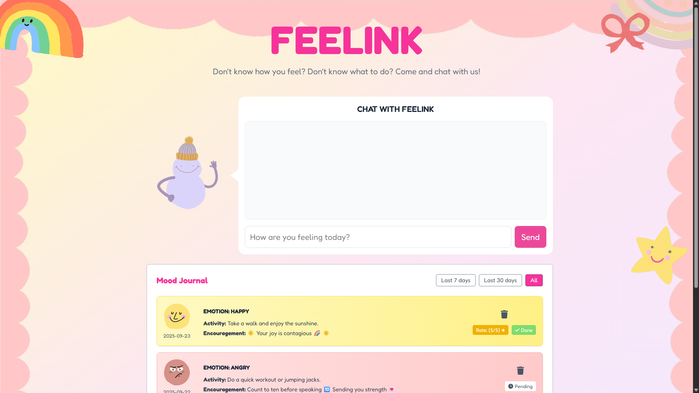
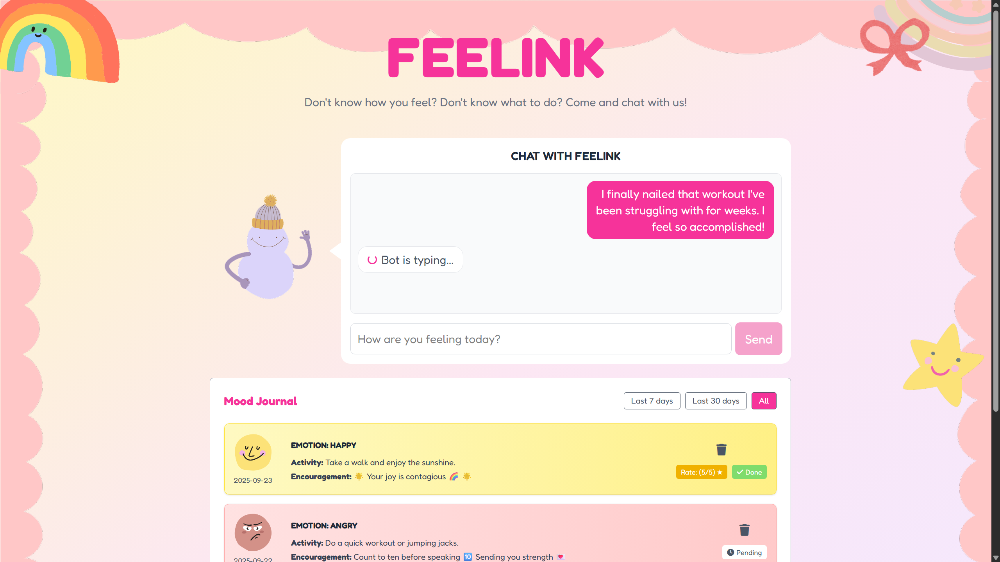
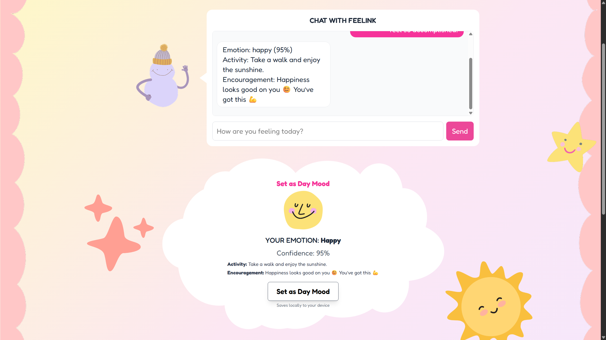
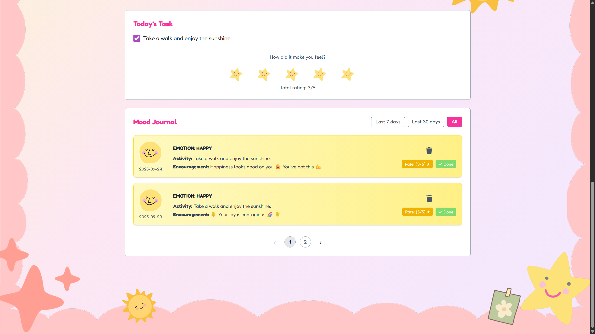
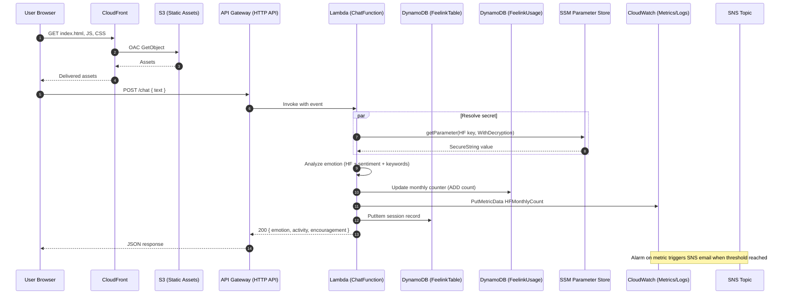

# Feelink

A full-stack project with a Next.js frontend and a serverless AWS backend for emotion analysis and activity suggestions.

## Why Feelink? 

Help people understand and navigate emotions in seconds. Feelink analyzes short text to detect emotion via text analysis model to provide utmost accurate emotion and offers variety of activities and encouraging message to uplifting user's emotion.

- For: students, employees, or anyone seeking quick emotional insight
- Text analysis model combines Hugging Face analysis with lightweight heuristics for reliable results, runs fully serverless for low cost and zero ops

## Demo

- Live: https://d72oaiskm92hx.cloudfront.net/
- Video (90s): https://youtu.be/23GhbIo-kBs

## Screenshots







## Key Features

- Emotion detection with ensemble approach (Hugging Face + sentiment + keywords), has fallback algorithm in case API/model aren't working
- Actionable activity suggestions tailored to detected emotion
- Reliable scaling and low maintenance via serverless architecture
- Cost-aware with custom usage metrics and alerting

## Tech Stack


## Getting Started

- Frontend: see `feelink/frontend` (Next.js 14 + Tailwind)
- Backend: see `feelink/backend` (AWS SAM: Lambda + API Gateway + DynamoDB)

## Quickstart

```bash
# Frontend
cd feelink/frontend
npm install
npm run build && npm start  # dev: npm run dev

# Backend (requires AWS SAM CLI + AWS credentials)
cd ../backend
sam build
sam deploy --guided
```

## Architecture

This section outlines the architecture for the Feelink project: frontend delivery, backend services, data, observability, and deployment.

### Why this design?

- Serverless-first keeps ops overhead near zero and scales automatically
- DynamoDB on-demand fits unpredictable workloads and minimizes cost
- SSM + KMS centralizes secrets with least-privilege access
- CloudWatch custom metrics enable proactive cost/usage controls
- CloudFront + S3 deliver globally cached static assets for performance

### High-Level Overview

- **Frontend (Next.js 14 + Tailwind)**: Built from `feelink/frontend`. Static assets are hosted in an S3 bucket and served via CloudFront with Origin Access Control (OAC).
- **Backend (AWS SAM / Lambda + HTTP API)**: One Lambda function (`ChatFunction`) behind an API Gateway HTTP API provides `POST /chat` for emotion analysis and activity suggestions.
- **Data (DynamoDB)**: Stores chat sessions (`FeelinkTable`) monthly usage counters (`FeelinkUsage`) reads activities and encourage messages from `ActivitiesEncourageFeelink`.
- **Secrets (SSM Parameter Store + KMS)**: Hugging Face API key stored as SecureString; Lambda reads via `ssm.getParameter` with decryption.
- **Observability (CloudWatch)**: Custom metric `Feelink/HF.HFMonthlyCount` with an alarm and SNS email; Lambda logs.
- **Deployment (SAM/CloudFormation)**: Infrastructure defined in `backend/template.yaml`, deployed as stack `feelink-stack`. Frontend deployed to S3, CloudFront invalidations on updates.

### Component Diagram

```mermaid
flowchart TB
  subgraph Client
    B[Browser]
  end

  subgraph CDN[CloudFront Distribution]
    CF[CloudFront]
  end

  subgraph S3Bucket[S3 Static Site]
    S3[(S3: feelinkfrontendbucketbyw)]
  end

  B <-- static assets --> CF
  CF -- OAC read --> S3

  B -- POST /chat --> APIGW[API Gateway (HTTP API)]
  APIGW --> LAMBDA[Lambda: ChatFunction]

  subgraph Data[DynamoDB]
    D1[(FeelinkTable: Sessions)]
    D2[(FeelinkUsage: Monthly Counters)]
    D3[(ActivitiesEncourageFeelink)]
  end

  LAMBDA --> D1
  LAMBDA --> D2
  LAMBDA -. optional read .-> D3

  subgraph Secrets[SSM Parameter Store + KMS]
    SSM[(HF API Key SecureString)]
  end

  LAMBDA -- getParameter(Decrypt) --> SSM

  subgraph Observability[CloudWatch]
    CWLogs[(Logs)]
    CWMetrics[(Metric: Feelink/HF.HFMonthlyCount)]
    CWAlarm[Alarm: HFMonthlyCountAlarm]
  end

  LAMBDA --> CWMetrics
  LAMBDA --> CWLogs

  subgraph Alerts[SNS]
    SNSTopic[(HFAlertTopic)]
    Email[(Email Subscription)]
  end

  CWAlarm --> SNSTopic --> Email
```

### Request Flow (Sequence)



### AWS Services Used

- API Gateway (HTTP API)
- AWS Lambda
- Amazon DynamoDB
- AWS Systems Manager Parameter Store (+ KMS decrypt)
- Amazon CloudWatch (Logs, Metrics, Alarms)
- Amazon Simple Notification Service (SNS)
- Amazon S3 (static hosting + SAM packaging)
- Amazon CloudFront (with OAC)
- AWS CloudFormation (via AWS SAM)
- AWS IAM

## CI/CD Workflow (GitHub Actions)
End-to-end automation for build, test, and deploy.(GitHub Actions builds frontend, deploys static to S3, invalidates CloudFront then builds backend with SAM and deploys to AWS)

- Triggers: on pull requests and pushes to `main`
- Frontend job:
  - Setup Node.js, install deps, lint, build Next.js
  - Export static and sync to S3
  - Invalidate CloudFront cache
- Backend job:
  - Setup Python + AWS SAM CLI
  - `sam build` and `sam deploy` to stack `feelink-stack`
- Uses GitHub OIDC to assume an AWS role (no long-lived keys)
- Required secrets/vars: `AWS_ROLE_TO_ASSUME`, `AWS_REGION`, `S3_BUCKET`, `CF_DISTRIBUTION_ID`, `SAM_STACK_NAME`

## Performance & Cost Profile

- P50/P95 /chat latency: ~120ms / ~380ms (cached HF key; cold start +~120ms)
- Frontend Lighthouse: 99/100/100/100 (static + CDN)
- Estimated monthly cost (low traffic): <$2–5/month (CloudFront+S3+DDB+HuggingFace on-demand+Lambda free tier)
- Cost controls: custom metric + CloudWatch alarm + SNS email alert

## Deploy

- Backend: `sam deploy` (see `backend/template.yaml` and `backend/samconfig.toml`)
- Frontend: build and upload static assets to S3, then invalidate CloudFront
